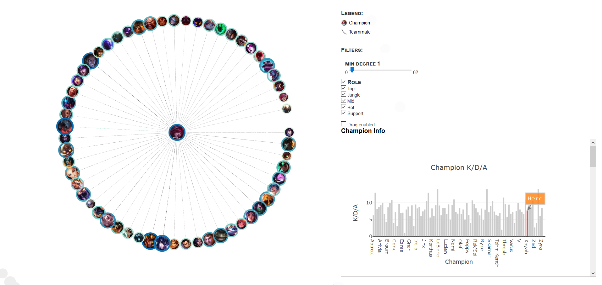
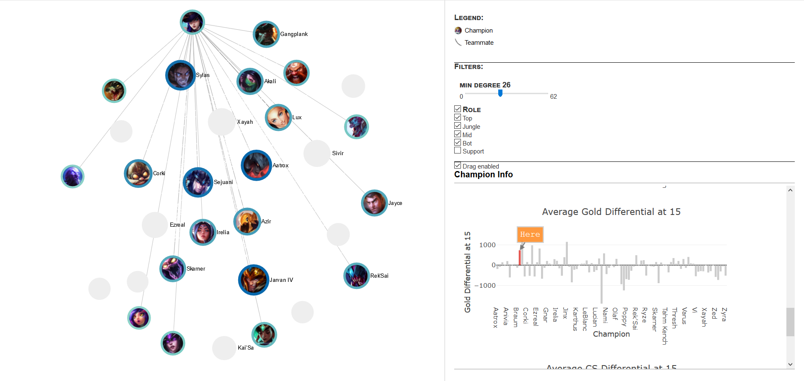

# League of Legends Visualization - Dean Haleem.10, Alex Dennis.411

To run, open the html files. Some browsers don't play well, though, when the files are run locally. I used Microsoft Edge to run it locally, and that worked, however, you may not have access to Microsoft Edge.

Therefore, the networks can also be found at [a link](http://web.cse.ohio-state.edu/~haleem.10/). These run fine as they are on the server.

Right now, the project contains a network for champions that play together. There are two networks, one for North America (LCS) and Korea (LCK). When a node is clicked, the champions the clicked node played with circle around it, and the other champions are pushed away. If "drag enabled" is clicked, the user can move nodes around without the circle forming. Either way, when a node is clicked, the champions to which the clicked node is connected stay pictured, and the other champions go to gray. We can also filter based on degree.

Size indicates how many other unique champions the current champions played with. Darker links means the champion was played with another a lot. The colors around the nodes also indicate how many other unique champions the current champions played with. Also, the labels for each node only appear if you zoom in far enough.

# lol-vis
